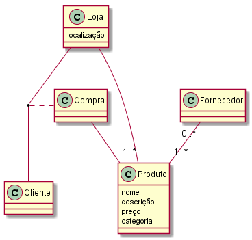

# Exame 2016

3\. C  
4\. A  
5\. B  
6\. A  
7\. C  
8\. D  
9\. C  
10\. E  
11\. B  

12\.

Para que a relação R se encontre na forma normal de Boyce-Codd é necessário que para cada Ā -> B, Ā seja uma (super) chave.

Para verificarmos tal, deve-se começar por verificar as dependências funcionais.

1º) Fazer o fecho do lado esquerdo.380
    
{A, B, C}+ -> {A, B, C, D, G, H, E}  
{F}+ -> {B, E, F}
{B}+ -> {B, E} 
{G}+ -> {G, H}

**Super-Chave** - {A, B, C, F}

13\. 



14\. 

```sql
SELECT E.nome, C.nome
    FROM Estudante AS E INNER JOIN Curso as C 
        ON E.curso = C.ID
    WHERE E.anoCurricular = 3;
```

15\.

```sql
SELECT nome FROM
    SELECT nome, COUNT(*) as numFriends FROM
        Amizade as A INNER JOIN Estudante as E
            ON A.ID1 = E.ID
                GROUP BY A.ID1
    WHERE numFriends > 3;
```

16\.

```sql
SELECT E1.NOME, E1.anoCurricular
    FROM Estudante AS E1
        WHERE E1.ID IN (
            SELECT E1.ID 
                FROM Estudante as E2, Amizade
                    WHERE Amizade.ID1 = E1.ID AND Amizade.ID2 = E2.ID AND E1.anoCurricular = E2.anoCurricular
        )
        AND E1.ID NOT IN (
            SELECT E1.ID
                FROM Estudante AS E2, Amizade
                    WHERE Amizade.ID1 = E1.ID AND Amizade.ID2 = E2.ID AND E1.anoCurricular <> E2.anoCurricular
        );
```

17\.

```sql
CREATE VIEW AmizadeEstudante AS
    SELECT *
        FROM Amizade as A INNER JOIN Estudante as E1
            ON A.ID1 = E1.ID
                INNER JOIN Estudante as E2
                    ON A.ID2 = E2.ID

SELECT DISTINCT E1.ID
    FROM AmizadeEstudante AS A1
        JOIN AmizadeEstudante AS A2
            ON A2.ID1 = A2.ID2
                JOIN AmizadeEstudante as A3
                    ON A3.ID1 = A2.ID2
                        WHERE A3.E1.nome = "Miguel Sampaio"
```

18\.

```sql
SELECT nome, anoCurricular 
    FROM
        SELECT *, MAX(numAmigos) FROM
            SELECT *, COUNT(*) as numAmigos
                FROM AmizadeEstudante 
                    GROUP BY A.ID1
```